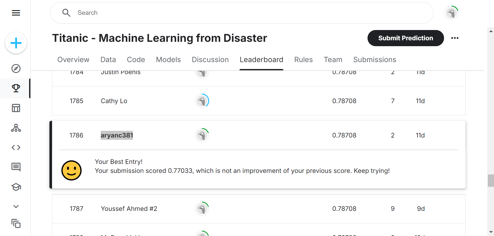

# Titanic Survival Rate Prediction using RFC


In this Kaggle project utilizing the Titanic dataset, I developed a Random Forest Classifier (RFC) to predict passenger survival outcomes. The model leverages various features, including seat class, ticket fare, age, sex, number of parents/children aboard, and number of siblings/spouses aboard to make its predictions.

## Dataset

This project was part of a Kaggle competition, you can check it out here: [Titanic ML from disaster - Kaggle](https://www.kaggle.com/competitions/titanic/overview)

This competition runs indefinitely. Once you register for it, you can find the dataset here: [Titanic Dataset](https://www.kaggle.com/competitions/titanic/data)
My rank was ```1786``` out of ```16401``` in the competition.

The data is in the form of a CSV file and is divided into two main parts:
1. `train.csv` - Used for training the model.
2. `test.csv` - Used for testing the model.
3. `gender_submission.csv` - Sample submission format file that you can refer to.

| Variable  | Definition                            | Key                                      |
|-----------|---------------------------------------|------------------------------------------|
| survival  | Survival                              | 0 = No, 1 = Yes                          |
| pclass    | Ticket class                          | 1 = 1st, 2 = 2nd, 3 = 3rd                |
| sex       | Sex                                   |                                          |
| Age       | Age in years                          |                                          |
| sibsp     | # of siblings/spouses aboard          |                                          |
| parch     | # of parents/children aboard          |                                          |
| ticket    | Ticket number                         |                                          |
| fare      | Passenger fare                        |                                          |
| cabin     | Cabin number                          |                                          |
| embarked  | Port of Embarkation                   | C = Cherbourg, Q = Queenstown, S = Southampton |

## Project Workflow

1. Importing dependencies.
2. Importing and preprocessing data.
3. Stratified shuffle split.
4. Handling missing values.
5. Creating pipeline.
6. Standardizing the pipeline.
7. Implementing Random Forest Classifier.
8. Prediction on train data.
9. Prediction on test data.
10. Conditional loop for a basic user interface.

## Detailed Steps

### 1. Importing Dependencies

```python
import pandas as pd
import numpy as np
import matplotlib.pyplot as plt
import seaborn as sns
```

### 2. Importing and Preprocessing Data

The data is divided into 3 parts:

- `train.csv` - This data is used for training the model.
- `test.csv` - This data is used for testing the model.

```python
titanic_data = pd.read_csv('train.csv')
```

### 3. Stratified Shuffle Split

```python
from sklearn.model_selection import StratifiedShuffleSplit

split = StratifiedShuffleSplit(n_splits=1, test_size=0.2)
for train_indices, test_indices in split.split(titanic_data, titanic_data[['Survived', 'Pclass', 'Sex']]):
  strat_train_set = titanic_data.loc[train_indices]
  strat_test_set = titanic_data.loc[test_indices]
```

### 4. Handling Missing Values

```python
from sklearn.base import BaseEstimator, TransformerMixin
from sklearn.impute import SimpleImputer

class AgeImputer(BaseEstimator, TransformerMixin):
    def fit(self, X, Y=None):
        return self

    def transform(self, X):
        imputer = SimpleImputer(strategy='mean')
        X['Age'] = imputer.fit_transform(X[['Age']])
        return X
```

### 5. Creating Pipeline

```python
from sklearn.pipeline import Pipeline
from sklearn.preprocessing import StandardScaler

num_pipeline = Pipeline([
    ('imputer', SimpleImputer(strategy='median')),
    ('std_scaler', StandardScaler())
])
```

### 6. Standardizing the Pipeline

```python
from sklearn.compose import ColumnTransformer

num_attribs = list(titanic_data.select_dtypes(include=[np.number]))
cat_attribs = ["Pclass", "Sex", "Embarked"]

full_pipeline = ColumnTransformer([
    ("num", num_pipeline, num_attribs),
    ("cat", OneHotEncoder(), cat_attribs),
])
```

### 7. Implementing Random Forest Classifier

```python
from sklearn.ensemble import RandomForestClassifier

clf = RandomForestClassifier(n_estimators=100, random_state=42)
titanic_prepared = full_pipeline.fit_transform(strat_train_set.drop('Survived', axis=1))
clf.fit(titanic_prepared, strat_train_set['Survived'])
```

### 8. Prediction on Train Data

```python
train_data_prepared = full_pipeline.transform(strat_train_set.drop('Survived', axis=1))
train_predictions = clf.predict(train_data_prepared)
```

### 9. Prediction on Test Data

```python
test_data_prepared = full_pipeline.transform(strat_test_set.drop('Survived', axis=1))
test_predictions = clf.predict(test_data_prepared)
```

### 10. Conditional Loop for Basic User Interface

```python
def predict_survival(passenger_data):
    passenger_prepared = full_pipeline.transform(passenger_data)
    return clf.predict(passenger_prepared)

while True:
    user_input = input("Enter passenger data or 'quit' to exit: ")
    if user_input.lower() == 'quit':
        break
    # Assume user_input is parsed into a DataFrame named passenger_data
    prediction = predict_survival(passenger_data)
    print("Survival prediction:", "Survived" if prediction == 1 else "Not Survived")
```

## Conclusion

This project demonstrates the use of Random Forest Classifier in predicting the survival of passengers aboard the Titanic. By preprocessing the data, handling missing values, and implementing a robust model pipeline, we achieved significant insights and predictions.

## Acknowledgements

- Kaggle for providing the dataset and platform for competition.
- Scikit-learn for providing robust machine learning tools.

## License

This project is licensed under the MIT License - see the [LICENSE](LICENSE) file for details.
```

You can adjust the sections, include more details, and add any additional content relevant to your project.
